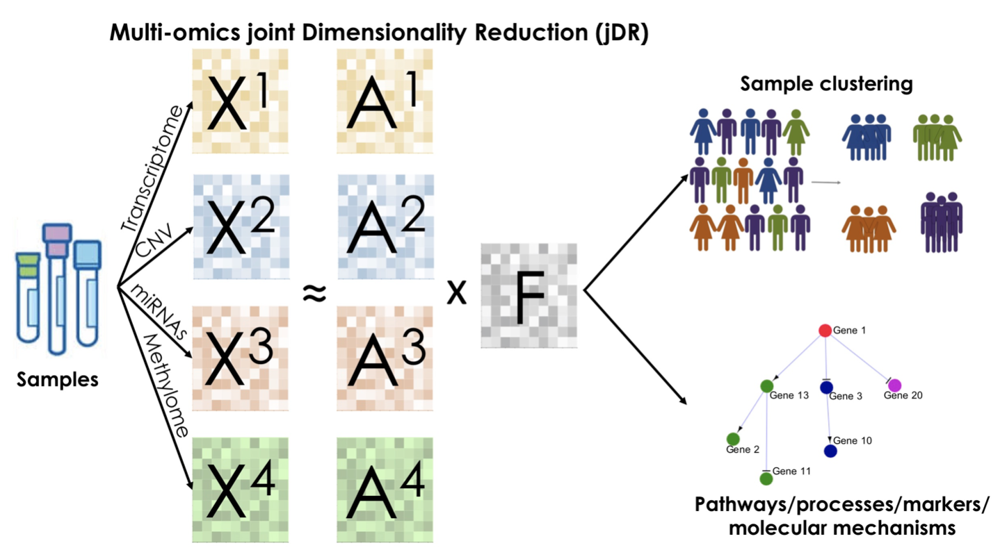
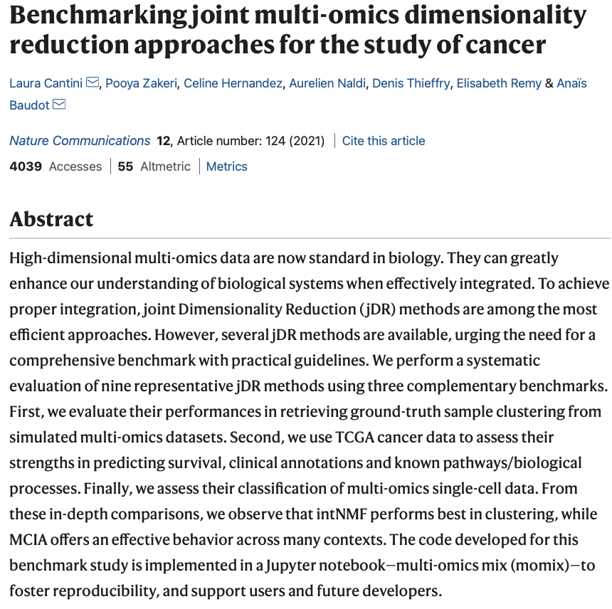
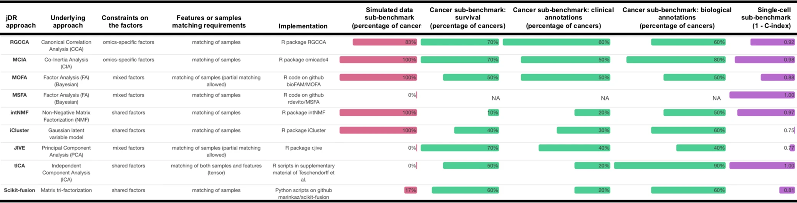
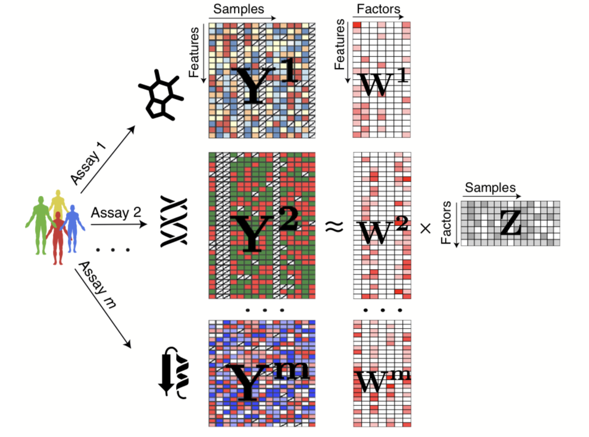
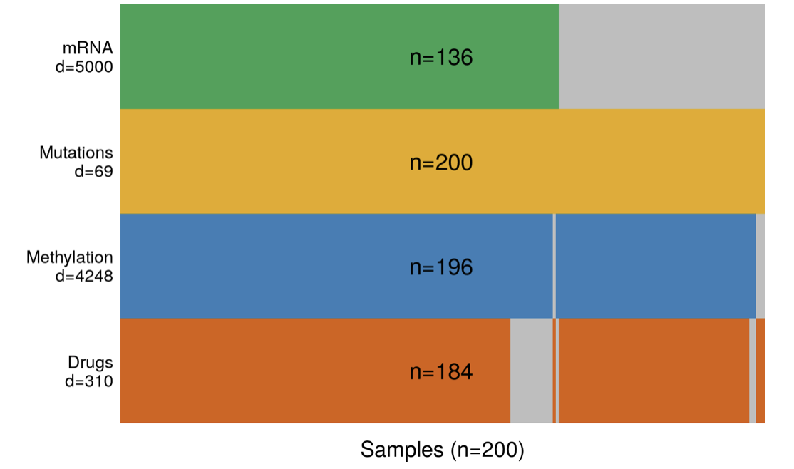

Overview

<small>[Picture: Cantini *et al* (2021)](https://github.com/ComputationalSystemsBiology/momix-notebook)</small>

---

---

Overview

<small>[Picture: Cantini *et al* (2021)](https://www.nature.com/articles/s41467-020-20430-7)</small>

---

Results for TCGA cancer data

- Association with survival and clinical annotations
-- MCIA, JIVE, MOFA and RGCCA

- Association with biological annotations
-- MCIA and tICA

---

Overview

<small>[Picture: Cantini *et al* (2021)](https://github.com/ComputationalSystemsBiology/momix-notebook)</small>

---

<small>[Picture: Argelaguet *et al* (2018)](https://www.embopress.org/doi/10.15252/msb.20178124)</small>

---

Aim

Benchmark MCIA, JIVE and MOFA on a dataset that account for these shortcomings.

---

Selected Dataset: Chronic lymphocytic leukaemia (CLL)

<small>[Picture: Wikipedia](https://en.wikipedia.org/wiki/Chronic_lymphocytic_leukemia#/media/File:Chronic_lymphocytic_leukemia.jpg)</small>

----

Available CLL multi-omics data

<small>[Data: Dietrich *et al* (2018)](https://www.zora.uzh.ch/id/eprint/143400/); [Picture: Argelaguet *et al* (2018)](https://bioconductor.org/packages/devel/bioc/vignettes/MOFA/inst/doc/MOFA_example_CLL.html)</small>

---

Take-away

At the end of the course the participants will:

- get hands-on experience in using three different data-integration methods
- learn advantages and limitations of different methods
- get an intuition of which method to apply for which kind of dataset
- get hands-on experience with handling missing values

---

Schedule

 
**Day2**\
15:00-16:00: [1:00] **Session 2.1** - Introduction to the methods\
16:00-16:15: [0:15] *Break*\
16:15-18:00: [1:45] **Session 2.2** - Data exploration and training the models

**Day3**\
15:30-16:15: [0:45] **Session 3.1** - Benchmarking on association with clinical annotations\
16:15-16:30: [0:15] *Break*\
16:30-17:30: [1:00] **Session 3.2** - Benchmarking on association with biological annotations\

---

Schedule

 
**Day4**\
16:15-17:00: [0:45] **Session 4.1** - Benchmarking on prediction of survival outcomes\
17:00-17:15: [0:15] *Break*\
17:15-18:00: [0:45] **Session 4.2** - Preparing presentation (advantages and limitations of these tools)\

---

Getting started

- All resources are available at <small>[https://github.com/Manikgarg/MultiOmicsDataIntegrationCourse2021](https://github.com/Manikgarg/MultiOmicsDataIntegrationCourse2021)</small>
- Navigate to the project directory via terminal
- Type `git pull` to make sure the files are up-to-date
- Follow along
- Raise hand or un-mute yourself to ask for help
