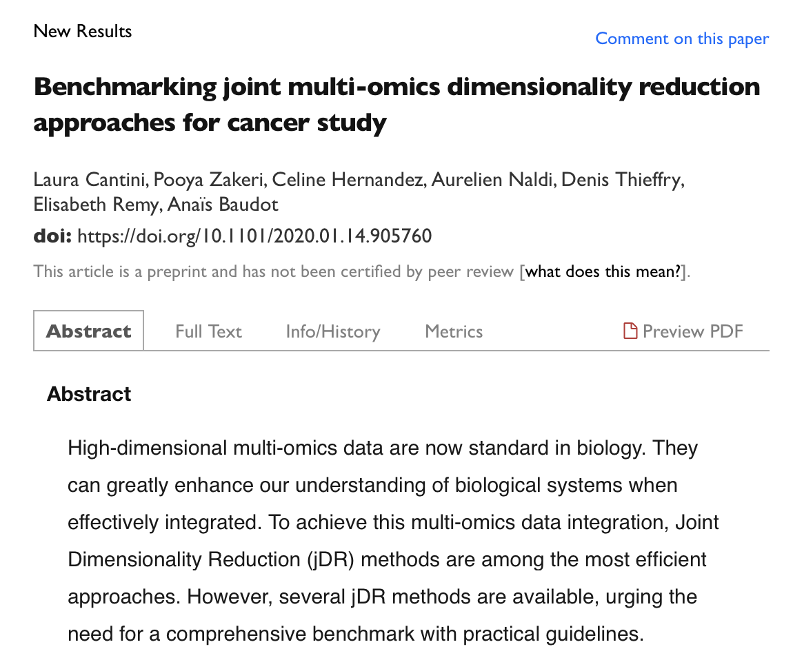

Overview

---

Results for TCGA cancer data

- Association with survival and clinical annotations
-- MCIA, JIVE, MOFA and RGCCA

- Association with biological annotations
-- MCIA and tICA

---

However for bechmarking

- Only continuous data was considered
- Same number of features were considered across all omics datasets
- Patients containing missing data were excluded

---

Aim

Benchmark MCIA, JIVE and MOFA on a dataset that account for these shortcomings.

---

Selected Dataset: Chronic lymphocytic leukaemia (CLL)

<small>[Picture: Wikipedia](https://en.wikipedia.org/wiki/Chronic_lymphocytic_leukemia#/media/File:Chronic_lymphocytic_leukemia.jpg)</small>

----

Available CLL multi-omics data

<small>[Data: Dietrich et al. (2018)](https://www.zora.uzh.ch/id/eprint/143400/); [Picture: Argelaguet et al. (2018)](https://bioconductor.org/packages/devel/bioc/vignettes/MOFA/inst/doc/MOFA_example_CLL.html)</small>

---

Schedule

 
**Day2**\
15:45-16:45: [1:00] **Session 2.1** - Introduction to the methods\
16:45-17:00: [0:15] *Break*\
17:00-17:45: [1:00] **Session 2.2** - Data exploration and training the models\

**Day3**\
14:30-15:30: [1:00] **Session 3.1** - Benchmarking on association with clinical annotations\
15:30-16:00: [0:30] *Break*\
16:00-17:30: [1:30] **Session 3.2** - Benchmarking on association with biological annotations\

---

 
**Day4**\
14:30-15:30: [1:00] **Session 4.1** - Benchmarking on prediction of survival outcomes\
15:30-16:00: [0:30] *Break*\
16:00-17:00: [1:00] **Session 4.2** - Understanding advantages and limitations of these tools\
17:00-17:30: [0:45] *Preparing presentation*\

---

Getting started

- All resources are available at <small>[https://github.com/Manikgarg/MultiOmicsDataIntegrationCourse2020](https://github.com/Manikgarg/MultiOmicsDataIntegrationCourse2020)</small>
- Navigate to the project directory via terminal
- Type `git pull` to make sure the files are up-to-date
- Follow along
- Use red sticker to ask for help
