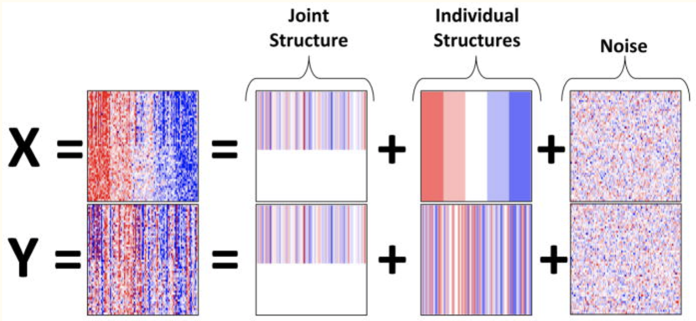

<small>[Picture: Argelaguet *et al* (2018)](https://www.embopress.org/doi/10.15252/msb.20178124)</small>

---

MOFA+

- Extension of Factor Analysis
- Doesn't require data imputation
- Finds a shared factor matrix
- Number of factors can be estimated
- Faster than MOFA with multi-group analysis
- Implemented as Bioconductor package `MOFA2`
- More info on:\
<small>[https://biofam.github.io/MOFA2/index.html](https://biofam.github.io/MOFA2/index.html)</small>

---

Joint and Individual Variation Explained (JIVE)

<small>[Picture: Lock *et al* (2013)](https://www.ncbi.nlm.nih.gov/pmc/articles/PMC3671601/)</small>

---

JIVE

- Extension of Principal Component Analysis
- Requires data imputation
- Finds both joint factor matrix and omics-specific factor matrices 
- Number of factors can be estimated
- Implemented as R package `r.jive`: <small>[https://cran.r-project.org/web/packages/r.jive/r.jive.pdf](https://cran.r-project.org/web/packages/r.jive/r.jive.pdf)</small>

---

Multiple co-inertia analysis (MCIA)

- Extension of Co-inertia Analysis
- Requires data imputation
- Finds omics-specific factor matrices but tries to maximize co-inertia between them
- Number of factors (axes) can be selected interactively from the scree-plot
- Implemented as Bioconductor package `omicade4`: <small>[https://www.bioconductor.org/packages/release/bioc/manuals/omicade4/man/omicade4.pdf](https://www.bioconductor.org/packages/release/bioc/manuals/omicade4/man/omicade4.pdf)</small>
