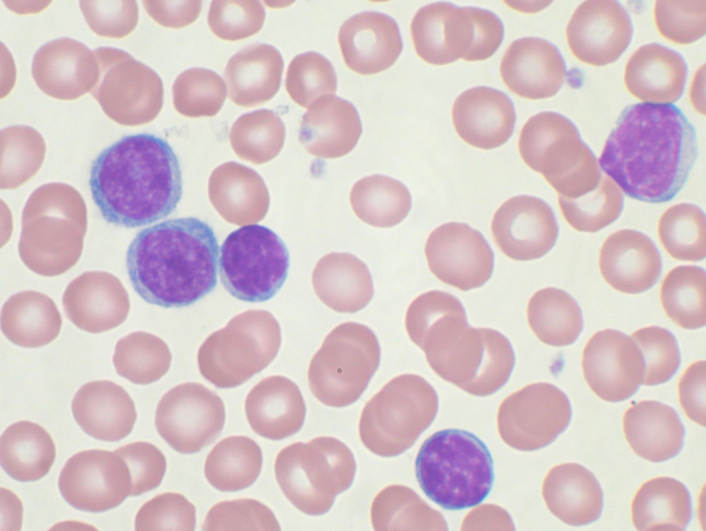

# Comparing different multi-omics data integration tools

## Overview
Several methods for multi-omics data integration exist, however, choosing the best method for a given dataset is still a challenge. In a recently available preprint, Laura *et al* (2020)1 tried to benchmark nine different data integration methods on TCGA cancer data and found that the methods Multi-omics factor analysis (MOFA)2, Multiple co-inertia analysis (MCIA)3, Joint and Individual Variation Explained (JIVE)4 and Regularized Generalized Canonical Correlation Analysis (RGCCA)5 performed consistently better than other five methods. However, this benchmark required matching of samples across different modalities, did not account for their performance on discrete data and did not account for the variations introduced by different imputation methods. Therefore, the aim of this project will be to benchmark the first three multi-omics data-integration methods on the [chronic lymphocytic leukaemia](https://en.wikipedia.org/wiki/Chronic_lymphocytic_leukemia) (CLL) dataset from Dietrich *et al* (2018)6 which provides an opportunity to account for these shortcomings.

## Dataset

The CLL dataset taken from Dietrich *et al* (2018) contains the following information from 200 patients:

- somatic mutations (69 x 200)
- RNA expression data (5000 x 136)
- DNA methylation (4248 x 196)
- ex vivo drug response (310 x 184)

## Benchmarks
For benchmarking purposes, different methods will be assessed on their ability to
- identify IGHV status and trisomy of chromosome 12
- selectively identify clinical annotations
- identify biologically meaningful pathways
- selectively identify biological pathways
- predict time to next treatment and overall survival 

See references 1 and 2 for more details.

## Take-away
At the end of the course the participants will:
- get hands-on experience in using three different data-integration methods
- learn advantages and limitations of different methods
- get an intuition of which method to apply for which kind of dataset
- get hands-on experience with handling missing values

## Pre-requisites
Working knowledge of R, basic understanding of maths/statistics and familiarity with gene-set enrichment analysis and survival analysis required. 

## Schedule

**Day2**\
15:45-16:45: [1:00] **Session 2.1** - Introduction to the methods\
16:45-17:00: [0:15] *Break*\
17:00-17:45: [1:00] **Session 2.2** - Data exploration and training the models

**Day3**\
14:30-15:30: [1:00] **Session 3.1** - Benchmarking on association with clinical annotations\
15:30-16:00: [0:30] *Break*\
16:00-17:30: [1:30] **Session 3.2** - Benchmarking on association with biological annotations

**Day4**\
14:30-15:30: [1:00] **Session 4.1** - Benchmarking on prediction of survival outcomes\
15:30-16:00: [0:30] *Break*\
16:00-17:00: [1:00] **Session 4.2** - Understanding advantages and limitations of these tools\
17:00-17:30: [0:45] *Preparing presentation*

## References
1. Cantini, Laura, et al. “Benchmarking joint multi-omics dimensionality reduction approaches for cancer study.” bioRxiv(2020).
2. Argelaguet, Ricard, et al. "Multi‐Omics Factor Analysis—a framework for unsupervised integration of multi‐omics data sets." Molecular systems biology 14.6 (2018).
3. Bady, Pierre, et al. "Multiple co-inertia analysis: a tool for assessing synchrony in the temporal variability of aquatic communities." Comptes rendus biologies 327.1 (2004): 29-36.
4. Lock, Eric F., et al. "Joint and individual variation explained (JIVE) for integrated analysis of multiple data types." The annals of applied statistics 7.1 (2013): 523.
5. Tenenhaus, Arthur, and Michel Tenenhaus. "Regularized generalized canonical correlation analysis." Psychometrika76.2 (2011): 257.
6. Dietrich, Sascha, et al. "Drug-perturbation-based stratification of blood cancer." The Journal of clinical investigation 128.1 (2018): 427-445.
